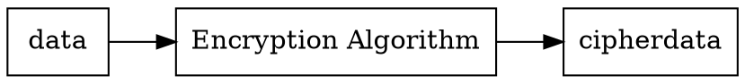
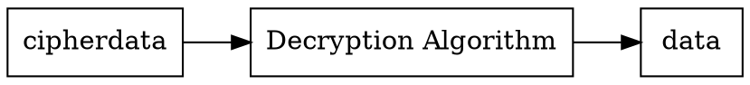
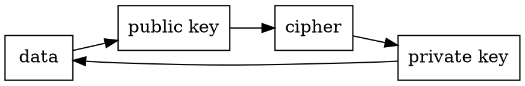
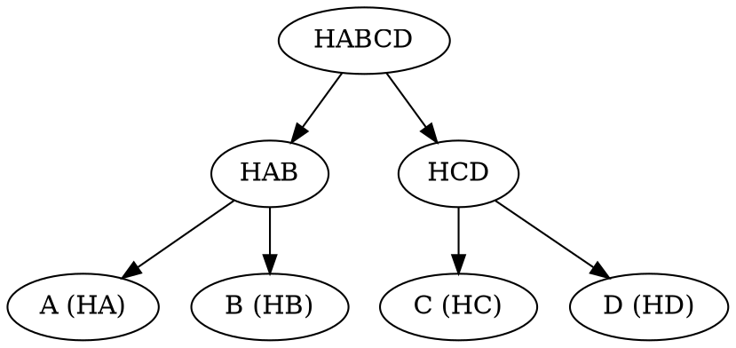

# Cryptography
The crytography is the method to communicate two peoples over an
unsecure medium. This born thanks the Auguste Kerckhoffs principle, this means
that all can be public, except the key.

Ciphertext: A plain text encrypted.

## Blockchain and Cryptography 
**Hashing**: create links between blocks.

**Digital Signature**: sign and verification.

**Asymmetric Key**: Identity to the participants. 

## Classic Cryptography  
The basic encryption model. 

* Encrypt

* Decrypt


### Substitution cipher
Is a techinque where the characters are replaced by others. Examples

* Caesar's cipher: Replace the characters in an offset of 3. **A is D**.
* Shift cipher: the offset of the above is the key in it.
* Polyalphabetic cipher: the offset has changes for every position. 
* Transposition cipher: Only The order of the characters are shift.
* Rail Fence cipher:  Transposition cipher variant.
* Route cipher:  Transposition cipher variant. 


Anagramming is the technique to decrypted transposition ciphers.

## Primitives  
Low-level cryptographic algorithms constructs cryptographic protocols.

### Unkeyed

* Hash Functions
* Pseudo random numbers

### Symmetric-key
Use the same key to encrypt and decrypt the data.

* Symetric-key ciphers

	* Stream ciphers: Each character are encrypted used the pseudo random
	 string as a keystream, the generator used digital shift registers.
	
	```dot
	digraph stream_cipher{
		node [shape=record]
		rankdir = "LR"
		"random key" -> generator -> "Pseudo random string"
	}
	```

	* Block ciphers: Encryption and Decryption are performe in a fixed
	length of characters in the block. Where some sizes how input are:

		* 64 bits
		* 128 bits
		* 256 bits 

#### Some cipher algorithm

* Data Encryption Standard (DES)
	* 64 bits **block**. 
	* 64 bits **key**. (56 bits with subtraction)
	
	key subtraction
	* 8 bits  **parity bits**:
	To calculate the odd parity used the 8th, 16th, 24th, 32th, 40th, 48th, 56th, 64th, the numbers of 1's is odd.
	
	This algorithm is vulnerable to brute-force and 3D solve this with 
	the implementation of the DES algorithm three times.
	
* Advanced Encryption Standard  (AES)
	The Rijndael algorithm is the standard.
	* 128 bits **block**.
	* 128, 192,256 **key**.
	
	This algorithm used the length of the key length to determine the interactions.   

	Nonce: "Number Only Used Once"
 
* International Data Encryption Algorithm (IDEA)
* Blowfish 

		


### Asymmetric-key
* Public-key ciphers
* Digital signatures


The problem with symmetric keys are is the key can be on the two peoples, this
shared would be over secure protocol. In the other hand Asymmetric keys use a
pair of keys (Public and Private).

RSA Algorithm is the first algorithm created at 1978 by Ronald Rivest, Adi 
Shamir, and Leonard Adleman. 

The public key couldn't determine the private key, is in the opposite direction the private key determine the public key. 

This approach is widely used in authentication signature and in blockchain 
is used to prove ownership. Some approaches.

* Diffie-Hellman d
* DSA
* ElGamal
* RSA
* Elliptic-curve Cryptography (ECC) 

#### Key Generation

This algorithms are used in three ways to generate the key, prime factorization, discrete logarithm, and elliptic curve. Also comes from number theory.

* Prime Factorization: This is the decomposition of a number into two prime numbers. (RSA)
* Discrete Logarithm:  the factor of discrete logarithm and modular arithmetic is knows as **modular exponentiation** used by (Diffie-Hellman).
 $$ log_b(a), a = b^x$$

* Elliptic-curve: this technique is used by ECC to generate private-public key
  from finite field.
$$ y^2  = x^3 + ax + b$$ 
 See the following article: https://eng.paxos.com/blockchain-101-elliptic-curve-cryptography

### RSA Cryptosystem
The public key is used to encrypt and decryption is based on the secretly
key, this advance is attributed by Whitfield Diffie and Martin Hellman.  

The public and the secret key are generated based on primes factorization 
with an amount of secret prime numbers, this provides a difficult way 
to determine from the public key the secret key. 

The following steps illustrates the way of RSA work.

1. Select p, and q amount of prime numbers.
2. Compute n = p*q 
$$\varphi(n) = (p-1)*(q-1)$$
3. Choose a random number
	$$\epsilon $$
	where
	$$ 1 <  \epsilon < \varphi $$
	and
	$$gcd(\epsilon, \varphi(n)) = 1, \text{Where } \epsilon \text{ and } \varphi \text{ are coprimes }$$ 

4.	Find 
	$$d \equiv e^{-1} (mod\ \varphi(n)) $$
	where 
	$$\epsilon \text{ is modular multiplicative inverse of } \epsilon$$

5. Public key is
	$$(\epsilon, n)$$
	and
	Private key is
	$$(d,p,q)$$ 
	where
	$$ \epsilon \text{, public exponent}$$
	$$ d \text{, private exponent}$$  

#### Encryption and Decryption
The encryption are performed with public key, where the message, m is
converted in integer.
$$ 0 \le m < n$$
The public exponent compute the cipher text so
$$ \text{ciphertext} \equiv m^e mod(n)$$ 

RSA is used in digital signatures because the a small messages are quickly
rather than large messages.

The Decryption is performe based on the private exponent, and only the 
person that has this unknown value, can performe the decryption. 

$$m \equiv c^d mod(n)$$ 

### Elliptic Curves
$$ y^2 = x^3 + ax + b mod(p) $$
What is finite field? A finite field is a set of prime numbers represented by p. and the before equation how mod\(p\).
$$ F_p = {0, ..., p-1}$$
In ECC is used the following domain of parameters.
$$ {p,a,b,G,n,h} $$
Where
* p: Finite field
* a and b: Constants
* G: The set of all points generated by the equation.
* n: The order of the base point. where nG = infinity
* h: The cofactor, witch the ratio is a group or subgroup of n. where
$$ h \le 4 $$ 
 
Elliptical curves uses point addition and point doubling.
#### Point Addition
We started with two points where this points have different values. 
$$  P \neq Q$$ 
Steps
1. Draw a secant line between points P and Q.
2. The line with intersect in one point the elliptic curve
3. Find the reflection of the intersection known as R. where 
$$ R(x,y) = P(x, y) + Q(x,y) $$ 

#### Point Doubling 
The point doubling started with P and Q, how point addition. However the
differences is that Q is moved to P.
$$  P = Q$$   

Steps  
1. Draw a tangent line to the curve at point P.   
2. The line with intersect in one point the elliptic curve
3. Find the reflection of the intersection known as R. where 
$$ R = (2R)$$ 

#### Compute the public key with point doubling
To compute the public key with point doubling we first defined.
$$ K = k*G$$
where 
* k: random private key.
* G: Generator of the curve or base point.
* K: public key. 

##### Technical details of secp256k1 
The following hyperlink express all the technical requirements to implement
the algorithm. https://en.bitcoin.it/wiki/Secp256k1 

## Digital Signature
Digital Signatures to proof the owner of a digital document.

* Sign

	```dot
	digraph{
		node [shape=record]
		rankdir="LR"
		Signer -> hash -> "private key" -> "Digital Signature"  
	}
	``` 
* Verification 

	```dot
	digraph{
		node [shape=record]
		rankdir="LR"
		 "Digital Signature" -> "public key" -> hash
	}
	```  

Use cases:
* Authenticity
* Non-Repudiation
* Integrity  


### Signing Process

Is the where the owner use the private key to sign a data, the following equation illustrates this process. 
$$ S = F_s(F_h(d), dU) $$ 
where
* S: Signature
* Fs: Signature function
* Fh: Hashing function 
* d : Data 
* dU: User private key  

### Verification Process
Verification is the process where the owner of the digital documents
distributes the public key and the signature.   

### Elliptical Curve Digital Signature Algorithm
This algorithm uses the ECC to create the key pairs, this is commonly used in
blockchain to sign transactions or events. 

ECDSA uses temporary key pairs to calculate a signature pair, R and S. Where k is chosen randomly. and the public key is 
$$ P = k*G $$
and the signature is
$$ S = k^{-1}(Hash(d) + dU * R)mod(p) $$ 

* p: prime order of the elliptic curve
* S: Signature
* d: data
* dU: User private key 

To verify ECDSA the algorithm use the R, S pair and the public key.
$$ P = S^{-1}*Hash(d)*G+S^{-1}*R*Qa $$ 
where:
* Qa: Public key of signer
* d: Data
* G: Based point 


## Cryptographic hashing
Cryptography hashing is a function that converts and arbitrary size of
data into a fixed size through function called hash. This function is used a lot in hash tables or more called dictionaries, with and O(1) time complexity
to access the data with the hash.

### Hash Function  
A hash function has the following properties
Basic
* Pre-image resistance: infeasible find message with the hash
* Second pre-image resistance: infeasible find message with a different hash
* Collision Resistance: second pre-image resistance.   
Advance
* input is the order O(1)
* Any change in it creates a new hash 

In blockchain hash function is used to create a unique identifier for each
block, where this link list has the before hash block, this provides integrity
to the blocks of the blockchain ledger.

#### Algorithms
* Message Digest
	* Secure hashing Algorithm (SHA): The first version SHA  was implemented
		in 2004, and the following are the versions. 
		* SHA-0
		* SHA-1: 224-256-384-512 bits
		* SHA-2: 256 bits (bitcoin used it)
		* SHA-3: 224-256-384-512
	* RACE Integrity Primitives Evaluation Message Digest (RIPEMD)

> To implemented the before theory we used PyCryptodome, this is a library that has low-level cryptographic primitives.

## Merkle trees 
The Merkle tree is a tree where nodes are hashes of the data blocks, the 
root hash is hashed with the node hashes and recursively to the root.
This tree used SHA256. 

Tree constraints:
* Balance tree 
The verification of an item is in time in big-notation is. 
$$ O(log_2(n))$$
 

## Encoding schemes
This encoding is used to transmission of textual data over a medium. 
* Base64: 
	* 26 lowercase letters
	* 26 Uppercase letters
	* 10 numerical characters
	* 2 special characters ("+" and "/") 
	
* Base58:
	* lower and upper characters, omitted the following.
		* 0 (zero)
		* O (character)
		* l (character) I (upper character)
		* 2 special characters ("+" and "/")

