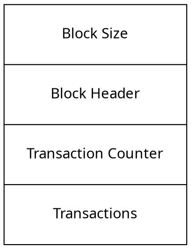
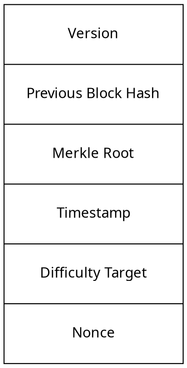
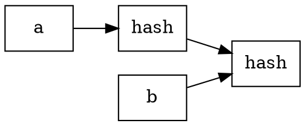

# Introduction to Blockchain

## Definition
Blockchain is a collection of blocks chain with another blocks. This is an
decentralized network without authorities. Also this technology overcome
some of the issues when there is buyer and seller are include. 

The blockchain is a decentralization project where each work is divided
by the nodes of the network, if one node failure, each nodes has a backup
of the blockchain maintaining the integrity. 

This technology provides (ISR): 
* Immutability
* Security
* Redundancy

## Differences with databases
The main differences is that databases allows CRUD(Create,Read,Update,Delete),
meanwhile the blockchain only allows append and read. The creator is the 
ledger. 

## History
Satoshi Nakamoto was the author of Bitcoin in 2008. He was the person that
deploy the first Bitcoin technology based on b-money and Hashcash called
Bitcoin.

Genesis block: The first block of Bitcoin created by Satoshi  Nakamoto.  

Block chain solve the problem of spam attack because used the algorithm to
verify the work, called *proof of work* and solving the blooding of the 
blockchain. 

## Blockchain 2.0 
Namecoin: Store key-value pairs in the public blockchain.  

Ethereum is the most successful project based on smart contracts, created by
Vitalik Buterin.  

Smart Contract are high-level scripts running on the EVM(Ethereum Virtual 
Machine) 

## Blockchain platforms
* **Corda**: Records, manages, and automates legal agreements between business 
partners.
* **Hyperledger**: The open source project maintained by Intel and IBM, hosted 
by Linux Foundation. 
* **Multichain**: Bitcoin compatibility provides access control.
* **NEO**: The Ethereum of China, digitizes assets. 

## Characteristics  

The blockchain have been using the cryptography how the secure method, but
this is don't secure that all, because a node can create a new block and 
share with the another and proof the work, for that we need more mechanism to
makes it harder to reconstruct blocks, this process is called inmmutability
because is harder change the block.

The nodes that performs *PoW* are called **mining nodes**. 

Another characteristics is Robustness and Transparent. 

The three characteristics derived into DLT(Distributed Ledger Technology). 

## Types
### Public Blockchain
The public blockchain permits to add more nodes without permissions, the 
disadvantage is that this can consume more power to create new block, because
the algorithms is more complicated to solve the puzzle. 

### Private Blockchain
A private blockchain solves the problem with public blockchain and is that
there is a way to create roles that provides the permission to create
new block, with that it reduces the attacks on it. But the immutability 
increase. 

### Corsortium Blockchain
A consortium blockchain is a mixed of the above types, this is a hybrid
type. 

## Blocks 
* Blocks have the same behavior of linked list starting with the genesis
genesis block. 
* Each block also has an identifier created by cryptography.
* The height of a block is the length of the linked list.
* The hash of the block isn't the hash of all data on the block, is the hash
of the metadata of the block, or header block.

### Structure
We can have how references the Bitcoin's permissionless structure.

#### Block Header

 
#### Linking blocks 
The hash value of the block is the combination of the previous block and the
current block. 

### Moore's law
This laws determined the growth or increases of a production or the used of
something in factor of 2.

